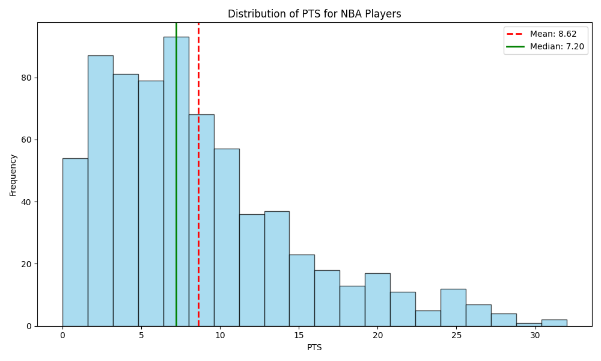
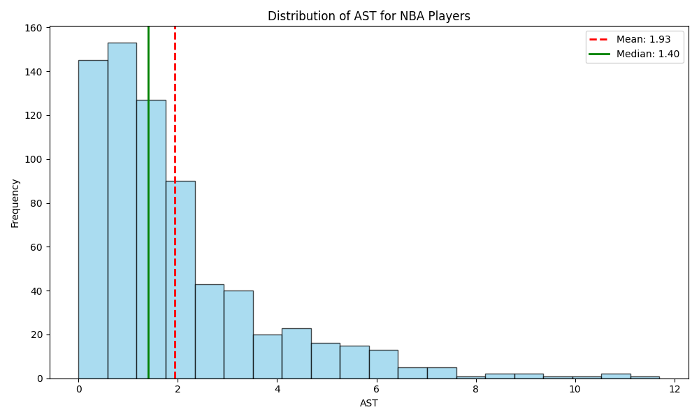
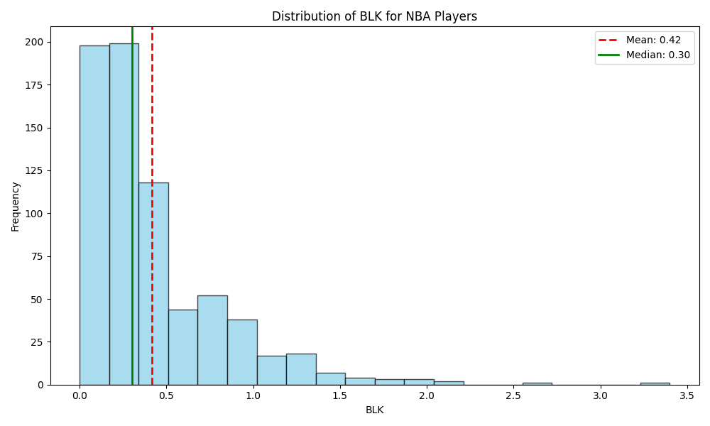

# IDS706_individual_project_1

## Requirements
* The project structure must include the following files:
    - Jupyter Notebook with: 
        + Cells that perform descriptive statistics using Polars or Panda.
        + Tested by using nbval plugin for pytest
    - Makefile with the following:
        + Run all tests (must test notebook and script and lib)
        + Formats code with Python blackLinks to an external site.
        + Lints code with RuffLinks to an external site.
        + Installs code via:  pip install -r requirements.txt
    - test_script.py to test script
    - est_lib.py to test library
    - Pinned requirements.txt
    - Gitlab Actions performs all four Makefile commands with badges for each one in the README.md

## Brief Introduction

### Dataset

#### [`NBA_2021.csv`](NBA_2021.csv)
This is the NBA 2021 global statistics table, which includes data for every player, such as PT (points), BL (blocks), and AT (assists).

### Python Scripts

In [`src/main.py`](src/main.py), This main.py script is used to read data from a CSV file, perform statistical analysis, and generate a data report. The script will generate three images and a PDF report. The three images are histograms showing the distribution of points, assists, and blocks for all players. Additionally, a PDF file with the report will be generated [here](NBA_2021_Report.pdf).

#### points histogram

#### assists histogram

#### blocks histogram

### Tests

There are three kinds of tests in this project.

* [test_lib.py]("src/test_lib.py"): this script is used to test functions in lib.py which contains functions shared by [`main.py`]("src/main.py") and [`python_ds_project_1.ipynb`]("python_ds_project_1.ipynb")

* [test_main.py]("src/test_main.py"): this script is used to test main if it successfully generate three figures and one PDF report.

* [test_notebook.py]("src/test_notebook.py"): this script is used to test if the output of jupyter notebook is the same as the saved output.
